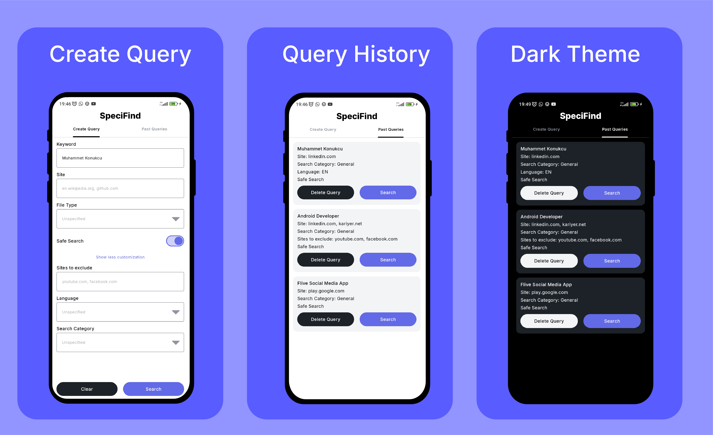
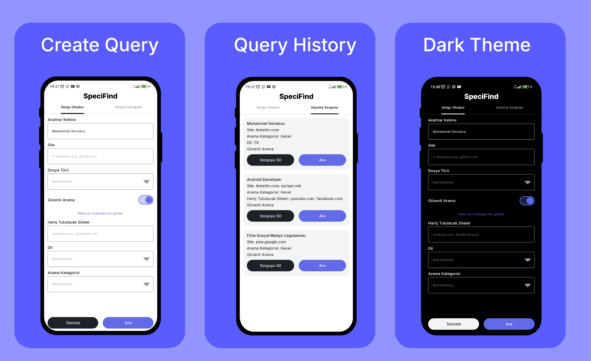

# 🔍 SpeciFind

A powerful **Compose Multiplatform** application for creating advanced Google search queries with
customizable parameters. **SpeciFind** allows users to build complex search queries using various
filters and operators, making it easier to find exactly what you're looking for on the web.
targeting both **Android** and **iOS** platforms.

## Screenshots



**Turkish Screenshots**



## ✨ Features

- **🔧 Advanced Search Query Builder**: Create sophisticated Google search queries with multiple
  parameters
- **📝 Query History**: Track and manage your past search queries with full pagination support
- **🎛️ Customizable Filters**:
    - 🔤 Keyword search
    - 🌐 Site inclusion/exclusion
    - 📄 File type filtering (PDF, DOC, DOCX, PPT, PPTX, XLS, XLSX, TXT, ZIP)
    - 🗣️ Language specification
    - 📂 Search category selection (Web, Images, News, Video, Books, Maps)
    - 🛡️ Safe search toggle
- **🌍 Multi-language Support**: Currently supports English and Turkish
- **🎨 Dark/Light Theme**: Automatic theme switching based on system preferences
- **📱 Cross-platform**: Built with Compose Multiplatform for Android and iOS platforms

## 🏗️ Architecture

The application follows modern Android development practices and architectural patterns:

### 🏛️ MVVM Pattern

- **📊 Model**: Data entities and repository pattern for data management
- **🖼️ View**: Jetpack Compose UI components
- **🎯 ViewModel**: State management and business logic

### 🔑 Key Components

- **HomeViewModel**: Manages search query building and form state
- **HistoryViewModel**: Handles query history with pagination support
- **Repository Pattern**: Abstracts data access layer
  with [HistoryLocalRepository.kt](composeApp/src/commonMain/kotlin/com/muhammetkonukcu/specifind/room/repository/HistoryLocalRepository.kt)

## 🛠️ Tech Stack

### ⚡ Core Technologies

- **🎨 Compose Multiplatform**: Modern declarative UI framework
- **🔧 Kotlin**: Programming language
- **⚡ Coroutines**: Asynchronous programming
- **🔄 StateFlow**: Reactive state management

### 📦 Dependencies

| Layer                   | Library                                                                 |
|-------------------------|-------------------------------------------------------------------------|
| 🎭 UI                   | [Jetpack Compose](https://developer.android.com/compose/)               |
| 💉 Dependency Injection | [Koin](https://insert-koin.io/)                                         |
| 🧭 Navigation           | [Navigation Compose](https://developer.android.com/guide/navigation)    |
| 🗄️ Persistence         | [Room](https://developer.android.com/jetpack/androidx/releases/room)    |
| 📄 Pagination           | [Multiplatform Paging](https://github.com/cashapp/multiplatform-paging) |

### 🏗️ Architecture Components

- **🎯 ViewModel**: UI-related data holder with lifecycle awareness
- **📊 LiveData/StateFlow**: Observable data holder classes
- **🏪 Repository Pattern**: Data access abstraction layer

## 📁 Project Structure

```
├── viewmodel/
│   ├── HomeViewModel.kt          # Main search form logic
│   └── HistoryViewModel.kt       # Query history management
├── ui/
│   ├── HomeScreen.kt            # Main search interface
│   ├── HistoryScreen.kt         # Query history display
│   └── MainScreen.kt            # Navigation and app structure
├── data/
│   ├── repository/              # Data access layer
│   ├── local/                   # Local database components
│   └── entities/                # Data models
└── di/                          # Dependency injection modules
```

## 🚀 Key Features Explained

### 🔧 Advanced Query Building

The app constructs Google search queries using various operators:

- `site:example.com` - Search within specific sites
- `-site:example.com` - Exclude specific sites
- `filetype:pdf` - Filter by file type
- `lang:en` - Specify language

### 📚 Query History Management

- **📄 Pagination**: Efficient loading of large query histories
- **💾 Persistence**: Local storage using Room database
- **🔄 Query Reconstruction**: Rebuild and reuse previous searches
- **🗑️ Deletion**: Remove unwanted queries from history

### 📱 Responsive UI

- **🔽 Expandable Options**: Show/hide advanced search parameters
- **✅ Real-time Validation**: Enable/disable search based on input validity
- **🎨 Material Design**: Consistent and modern UI following Material 3 guidelines

## 🚀 Getting Started

### Prerequisites

- Android Studio Giraffe or later
- Kotlin Multiplatform Mobile plugin

### 📥 Installation

1. Clone the repository:
  ```bash
  git clone https://github.com/MuhammetKonukcu/SpeciFind.git
  ```
2. Open in Android Studio
3. Sync project with Gradle files
4. Run the application

### ⚙️ Configuration

The app uses Koin for dependency injection. Key modules:

- `appModule()`: ViewModels and core components
- `databaseModule()`: Database configuration (platform-specific)
- `localRepositoryModule()`: Repository implementations

## 📖 Usage

1. **🔍 Create Query**: Enter your search parameters in the main screen
2. **⚙️ Advanced Options**: Toggle "Show more customization" for additional filters
3. **🔎 Search**: Tap the search button to open Google with your constructed query
4. **📝 History**: Switch to the history tab to view and reuse previous queries
5. **🧹 Management**: Delete unwanted queries or search directly from history

## 🌍 Localization

The app supports multiple languages through Compose Multiplatform's resource system:

- English (default)
- Turkish
- Extensible for additional languages

## 🤝 Contributing

This project follows clean architecture principles and modern Android development practices. When
contributing:

- Follow MVVM pattern
- Use Compose for UI components
- Implement proper error handling
- Write clear commit messages
- Maintain consistency with existing code style

## 📄 License

This project is licensed under the MIT License.

## 🙏 Acknowledgments

Built with modern Android development tools and practices, leveraging the power of Compose
Multiplatform for cross-platform compatibility.